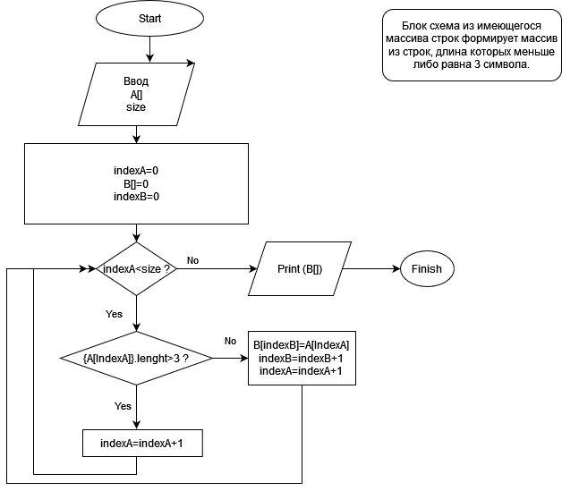

Задача. Написать программу, которая из имеющегося массива строк формирует массив из строк, длина которых меньше либо равна 3 символа. 
Первоначальный массив можно ввести с клавиатуры, либо задать на старте выполнения алгоритма. При решении не рекомендуется пользоваться
коллекциями, лучше обойтись исключительно массивами.

"Блок схема"

Описание программы:
Вводим с клавиатуры массив через запятую. Проверяем количество символов каждого элемента массива меньше либо
равно трем? Если да то печатаем этот элемент, если нет то идем дальше.

